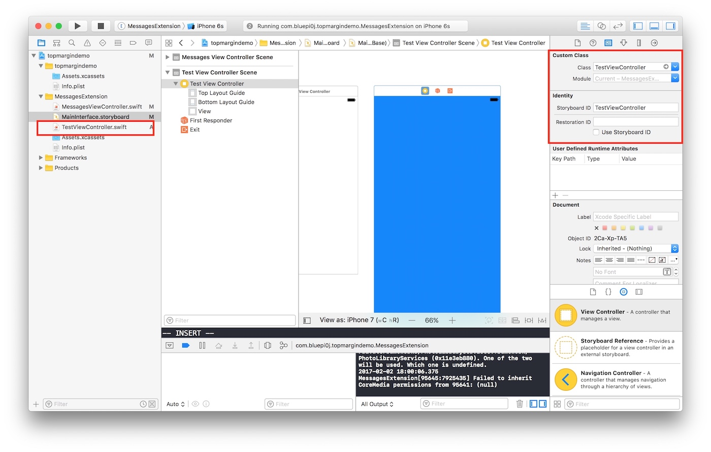
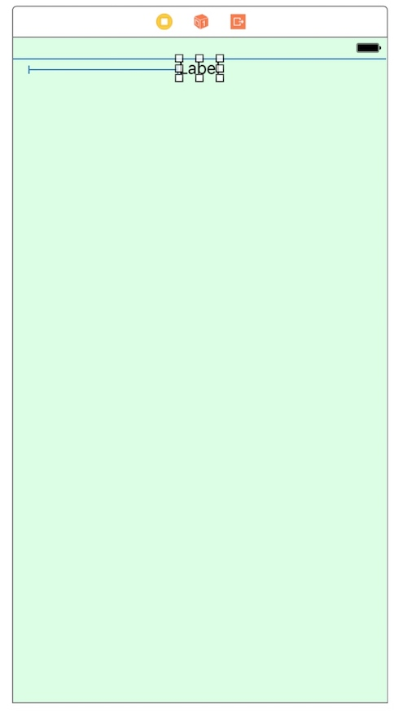
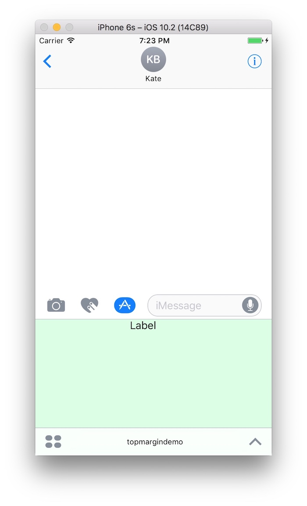
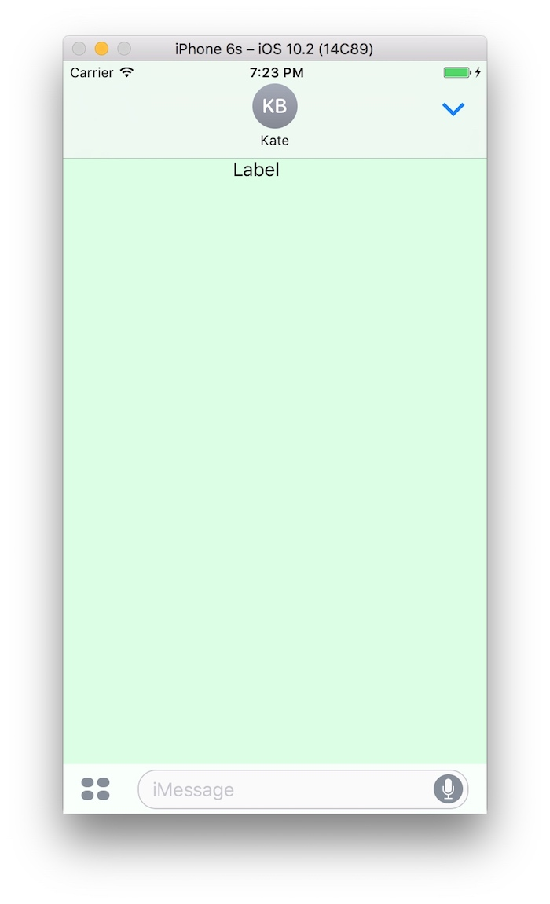
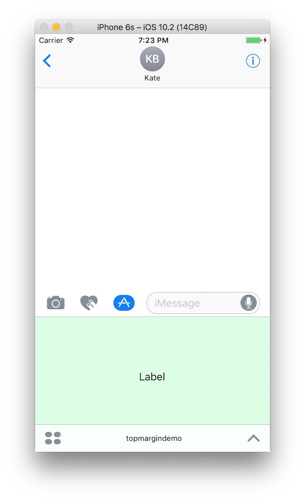
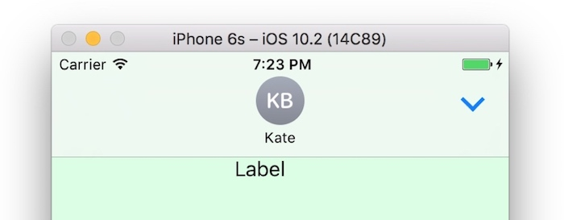
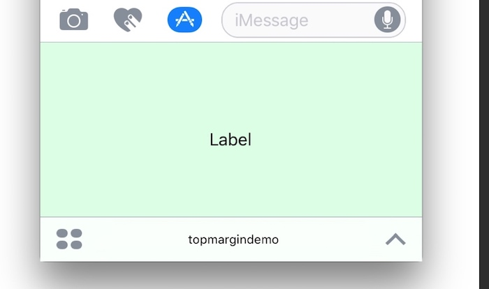

title: Top Margin Pitfall Of iMessage App Development between compact and expanded in swift 3.0.1
date: 2017-02-03 01:20:00 +0800
author: me
cover: images/program_banner.jpg #可选
draft: false #草稿，可选
top: false #置顶文章，可选
preview:  I just recently started an iMessage App, I am facing a tricky problem about autolayout of top margin. This post is about the issue and my solution.
tags: #可选
    - Objective-c
    - iOS
type: post

---


I just recently started an iMessage App, I am facing a tricky problem about autolayout of top margin. This post is about the issue and my solution.

Apple provide us a sample Messages app extension [`ice cream builder`](https://developer.apple.com/library/content/samplecode/IceCreamBuilder/Introduction/Intro.html)

Based on the structure of ice cream builder, we create a new ViewController `TestViewController`


then add 

```

static let storyBoardIdentifier = "TestViewController"

```
in `TestViewController.swift`

According to the `ice cream builder`, In the `MessageViewController.swift`, we add two function, `instantiateViewController()` to init the viewController and `presentViewController(with presentationStyle: MSMessagesAppPresentationStyle)` to add and present ViewController.

``` swift
 private func instantiateViewController() -> UIViewController {
        
        // Instantiate a `instantiateViewController` and present it.

       guard let controller = (storyboard?.instantiateViewController(withIdentifier: TestViewController.storyBoardIdentifier)) as? TestViewController  else { fatalError("Unable to instantiate an IceCreamsViewController from the storyboard") }
        
        return controller
    }
```
&nbsp;
 
``` swift
private func presentViewController(with presentationStyle: MSMessagesAppPresentationStyle) {
        let controller: UIViewController
        
        controller = instantiateViewController()
        
        // Remove any existing child controllers.
        for child in childViewControllers {
            child.willMove(toParentViewController: nil)
            child.view.removeFromSuperview()
            child.removeFromParentViewController()
        }
        
        // Embed the new controller.
        addChildViewController(controller)
        
        controller.view.frame = view.bounds
        controller.view.translatesAutoresizingMaskIntoConstraints = false
        view.addSubview(controller.view)
        
        controller.view.leftAnchor.constraint(equalTo: view.leftAnchor).isActive = true
        controller.view.rightAnchor.constraint(equalTo: view.rightAnchor).isActive = true
        controller.view.topAnchor.constraint(equalTo: view.topAnchor).isActive = true
        controller.view.bottomAnchor.constraint(equalTo: view.bottomAnchor).isActive = true
        
        controller.didMove(toParentViewController: self)
    }
```

Then add `presentViewController(with presentationStyle: MSMessagesAppPresentationStyle)`  in

``` swift
    override func willTransition(to presentationStyle: MSMessagesAppPresentationStyle) {
        // Called before the extension transitions to a new presentation style.
    
        // Use this method to prepare for the change in presentation style.
        presentViewController(with: presentationStyle)
    }
```
and 

``` swift
    override func willBecomeActive(with conversation: MSConversation) {
        // Called when the extension is about to move from the inactive to active state.
        // This will happen when the extension is about to present UI.
        
        // Use this method to configure the extension and restore previously stored state.
        presentViewController(with: presentationStyle)
    }
```
It looks good now, but after I add any UI element in it with constraint, it will cause top margin issue.
For example, we add a label in the top of TestViewController.



Run the iMessage app

**.compact mode:**


**.expanded mode:**



**.compact mode:**


The top margin is changed.

As we see in the **.expanded mode**, the top name area is green. It means the TestViewController actually fill all the window. but the label is right under the top name area. So after we set the constraint, apple will handle the layout for you.

 
1. When we open the iMessage app, it's **.compact mode:**, label is in the right place
2. **.expanded mode**, and apple move the label down to fit the top bar.
3. Go back to **.compact mode:**, label can't move back to original place.


**This is the top margin issue I faced.**



In Apple's sample `ice cream builder`, since they use different ViewControllers for `.compact` and `.expanded`, so this issue doesn't happen in their demo.

---


**Solution:**

In the `presentViewController(with presentationStyle: MSMessagesAppPresentationStyle)` function, instead of using view.topAnchor and view.bottomAnchor

```swift    
controller.view.leftAnchor.constraint(equalTo: view.leftAnchor).isActive = true
controller.view.rightAnchor.constraint(equalTo: view.rightAnchor).isActive = true
controller.view.topAnchor.constraint(equalTo: view.topAnchor).isActive = true
controller.view.bottomAnchor.constraint(equalTo: view.bottomAnchor).isActive = true
```

We use `topLayoutGuide.bottomAnchor` and `bottomLayoutGuide.topAnchor`

```swift
controller.view.leftAnchor.constraint(equalTo: view.leftAnchor).isActive = true
controller.view.rightAnchor.constraint(equalTo: view.rightAnchor).isActive = true
controller.view.topAnchor.constraint(equalTo: topLayoutGuide.bottomAnchor).isActive = true
controller.view.bottomAnchor.constraint(equalTo: bottomLayoutGuide.topAnchor).isActive = true
```

It seems like ViewControllers aren't respecting the top and bottom layout guides.

My full demo is in [https://github.com/bluepi0j/iMessage-Top-Margin-issue-Demo](https://github.com/bluepi0j/iMessage-Top-Margin-issue-Demo)


